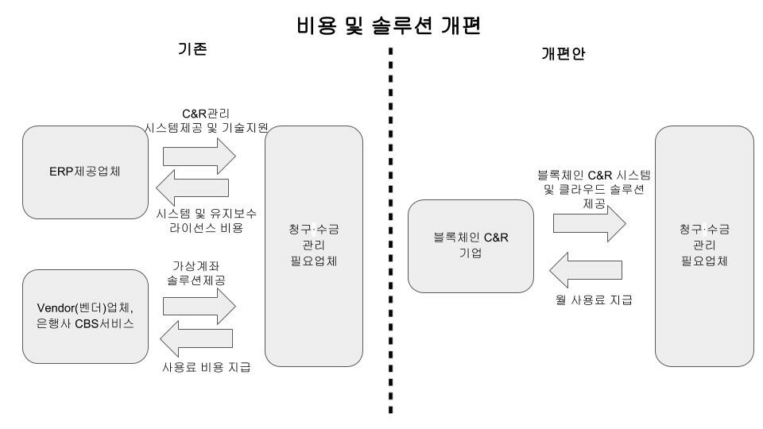

# 참가 신청서

<table border="2" cellspacing="0" cellpadding="6" rules="groups" frame="hsides">

<colgroup>
<col  class="org-left" />

<col  class="org-left" />
</colgroup>
<tbody>
<tr>
<td class="org-left">응모분야</td>
<td class="org-left">창업모델분야</td>
</tr>

<tr>
<td class="org-left">활용 기술</td>
<td class="org-left">Hyperledger Fabric</td>
</tr>

<tr>
<td class="org-left">언어</td>
<td class="org-left">Go, NodeJS</td>
</tr>

<tr>
<td class="org-left">서비스</td>
<td class="org-left">클라우드, Web</td>
</tr>
</tbody>
</table>

<table border="2" cellspacing="0" cellpadding="6" rules="groups" frame="hsides">

<colgroup>
<col  class="org-left" />

<col  class="org-left" />

<col  class="org-left" />

<col  class="org-right" />

<col  class="org-left" />

<col  class="org-left" />
</colgroup>
<thead>
<tr>
<th scope="col" class="org-left">분류</th>
<th scope="col" class="org-left">이름</th>
<th scope="col" class="org-left">소속</th>
<th scope="col" class="org-right">생년월일</th>
<th scope="col" class="org-left">이메일</th>
<th scope="col" class="org-left">비고</th>
</tr>
</thead>

<tbody>
<tr>
<td class="org-left">팀장</td>
<td class="org-left">이동수</td>
<td class="org-left">고려대학교</td>
<td class="org-right">931201</td>
<td class="org-left">dongsoolee8@gmail.com</td>
<td class="org-left">프로젝트 관리, 개발</td>
</tr>

<tr>
<td class="org-left">팀원</td>
<td class="org-left">박준우</td>
<td class="org-left">고려대학교</td>
<td class="org-right">970201</td>
<td class="org-left">junwoopark97@naver.com</td>
<td class="org-left">개발</td>
</tr>

<tr>
<td class="org-left">팀원</td>
<td class="org-left">옥준우</td>
<td class="org-left">수성GN(주)</td>
<td class="org-right">&#xa0;</td>
<td class="org-left">jwok91@naver.com</td>
<td class="org-left">아이디어 제공, 자문</td>
</tr>
</tbody>
</table>

블록체인 해커톤을 통해 B2B 거래에서 존재하는 문제점들을 블록체인을 이용해서 해결할 수 있을지 고민하고,
블록체인 기술이 암호화폐 뿐만 아니라 다양한 분야에서 응용될 수 있는 기술임을 증명하고자 합니다.
또한 Hyperledger Fabric 기술을 이용하여 기업들이 선호하는 프라이빗 블록체인의 구조를 연구하고 이를 사업화를 하기 위한 프로토타입 구현을 하기 위해 지원하였습니다.

# 개발 기획서

## 추진배경

물류회사와 같이 거래가 활발한 업종들은 다른 업종에 비하여 거래처의 수와 거래량이 많다(수성GN(주) 기준 월 평균 대략 3천건 이상).
또한 고정거래처 뿐만 아니라 단발성 거래처도 다수 발생되어 관리 포인트가 다양하고 지역적, 위치적 상황에 따라서 동일업체의 매출이 여러 지역에서 발생된다.
이로 인해 청구 및 수금 업무가 간단하지 않고 거래기간이 증가됨에 따라 매입누락이 발생하게 되며, 이를 곧바로 처리하지 않으면 추후 누락된 금액을 처리하기 위해 상당한 시간과 많은 인력이 소모된다.
뿐만 아니라 각 지역에 수금을 담당하는 담당자가 퇴사시 인수인계 미흡으로 인해 수금내역이 누락되는 경우도 빈번하고 이를 바로잡기 위해 거래처와 매입매출을 확인하는데 많은 시간과 노력이 소요된다.
하지만 많은 거래량으로 인해 정확한 매입매출의 추적이 어렵고 따라서 추적이 불가능한 매출은 청구 미수금으로 처리되어 회사의 순수익으로 잡히게 된다.
이는 매출로 처리되지 못한 금액으로 정상적으로 처리되었을 때 보다 더 많은 세금을 내게 되고, 출처를 알 수 없는 수익이 되고 회계감사로 인한 불이익을 받을 수 있다.

이러한 문제가 발생하는 원인은 여러 기업들이 서로 다른 ERP 시스템을 사용하여 기업간 거래 장부가 동기화가 되지 않고,
구매사는 자사의 편의를 위해 대금을 지급할 때 판매사가 지정한 계좌가 아닌 판매사 대표 계좌 혹은 본사 계좌(판매사의 지사에서 청구를 요청했는데도 불구하고)로 보내 판매사에서는 청구한 금액에 대한 수금 처리를 하기가 매우 힘들어진다.
또한 그렇게 보내진 대금은 구매사의 편의에 따라 여러 청구를 합쳐서 한번에 보내기도 하는데, 판매사 입장에서는 해당 금액이 어떤 거래에서 나온 매출인지를 재추적해야 하는 번거로움이 생긴다.

따라서 Hyperledger Fabric(이하 HLF)를 이용한 블록체인 기반 청구 및 수금 솔루션을 도입해 기업간 거래 시 동일한 거래 장부를 공유하고 청구 및 수금 업무를 간소화 하여 기존에 수금처리로 낭비되었던 시간과 비용 및 잠재적인 회계문제를 줄이고자 한다.

## 개발 목표 및 내용

### 개발 목표

기업들간 거래시 청구 및 수금을 원활하게 할 수 있는 블록체인 시스템 구현과 기업들이 시스템을 간편하게 사용할 수 있도록 웹 기반 인터페이스 제공을 목표로 한다.

### 개발 내용

HLF을 이용해 Peer간 채널 연결을 통하여 거래하는 기업간 장부를 공유하는 시스템을 구축하고 해당 장부들은 MSP 인증을 통해서만 접근권한을 얻을 수 있게 함으로써 경쟁업체로부터 기업의 거래 장부 데이터를 보호할 수 있도록 개발 한다.
참여하는 기업들이 서로 합의해 채널에 들어올 새로운 기업을 추가 및 제거할 수 있도록 하고, 기업별로 각 채널의 장부를 통합 관리하는 내부 장부를 백업본으로 저장할 수 있도록 개발 한다.

거래에 참여하는 기업들은 웹 인터페이스를 통해 청구, 대금 지급 등의 액션으로 블록을 생성 및 업데이트를 할 수 있고, 청구 현황, 대금 현황 등으로 생성된 블록을 열람할 수 있도록 개발 한다.

### 개발 범위

#### 시스템 부분

HLF 체인코드와 API를 이용하여 전반적인 블록체인 시스템 및 웹 서버를 구축하는 부분이다.

1.  HLF 기반으로 거래하는 기업들간 인증을 통해 서로의 거래 장부를 공유하는 시스템 구축
2.  HLF의 체인코드로 '청구', '수금', '수금 취소', '수금 확인' 등의 트랜잭션 구현
3.  기업간 거래에 참여하는 다른 기업들을 Chnnel을 추가하고 삭제하는 등의 기능 구현
4.  사용자 접근을 위한 웹 서버 구축
5.  사용자가 로그인을 통해 기업 Organization에 인증하는 기능 구현

#### 웹 인터페이스 부분

HLF 클라이언트 API와 Vue.js를 기반으로 사용자가 블록체인 시스템에 접근하기 쉽도록 인터페이스를 구축하는 부분이다.

1.  로그인 인터페이스 구현
2.  채널 리스트, 선택, 추가, 삭제 인터페이스 구현
3.  청구, 수금현황, 대금지급, 대금현황 등의 인터페이스 구현

### 시스템 구조

#### 블록 구조

본 시스템에서 블록 구조는 두 종류로 나뉜다.
첫번째는 둘 이상의 다른 기업 간에 공유하는 '거래 장부'이고, 두번째는 하나의 기업 내부 보관용으로 사용되는 '내부 장부'이다.

1.  거래 장부
    이 장부는 다른 기업간의 거래 시 사용되는 장부로, 둘 이상의 기업이 참여하여 청구/수금 요청을 위한 장부를 작성한다.
    다음과 같은 정보가 장부에 기록된다.
    
    <table border="2" cellspacing="0" cellpadding="6" rules="groups" frame="hsides">
    
    
    <colgroup>
    <col  class="org-left" />
    
    <col  class="org-left" />
    </colgroup>
    <thead>
    <tr>
    <th scope="col" class="org-left">스키마</th>
    <th scope="col" class="org-left">내용</th>
    </tr>
    </thead>
    
    <tbody>
    <tr>
    <td class="org-left">source</td>
    <td class="org-left">다른 기업에게 청구를 하는 주체</td>
    </tr>
    
    
    <tr>
    <td class="org-left">target</td>
    <td class="org-left">청구를 요청 받은 기업</td>
    </tr>
    
    
    <tr>
    <td class="org-left">items[]</td>
    <td class="org-left">청구 품목 내용</td>
    </tr>
    
    
    <tr>
    <td class="org-left">items.name</td>
    <td class="org-left">청구 물품 이름</td>
    </tr>
    
    
    <tr>
    <td class="org-left">items.price</td>
    <td class="org-left">청구 물품 가격</td>
    </tr>
    
    
    <tr>
    <td class="org-left">items.quantity</td>
    <td class="org-left">청구 물품 개수</td>
    </tr>
    
    
    <tr>
    <td class="org-left">total</td>
    <td class="org-left">전체 대금</td>
    </tr>
    
    
    <tr>
    <td class="org-left">balance</td>
    <td class="org-left">잔금</td>
    </tr>
    
    
    <tr>
    <td class="org-left">payment date</td>
    <td class="org-left">결제 기준일</td>
    </tr>
    
    
    <tr>
    <td class="org-left">confirm</td>
    <td class="org-left">수금 확인 여부</td>
    </tr>
    </tbody>
    </table>
2.  내부 장부
    
    <table border="2" cellspacing="0" cellpadding="6" rules="groups" frame="hsides">
    
    
    <colgroup>
    <col  class="org-left" />
    
    <col  class="org-left" />
    </colgroup>
    <thead>
    <tr>
    <th scope="col" class="org-left">스키마</th>
    <th scope="col" class="org-left">내용</th>
    </tr>
    </thead>
    
    <tbody>
    <tr>
    <td class="org-left">channel</td>
    <td class="org-left">해당 장부가 생성된 채널 이름</td>
    </tr>
    
    
    <tr>
    <td class="org-left">source</td>
    <td class="org-left">다른 기업에게 청구를 하는 주체</td>
    </tr>
    
    
    <tr>
    <td class="org-left">target</td>
    <td class="org-left">청구를 요청 받은 기업</td>
    </tr>
    
    
    <tr>
    <td class="org-left">items[]</td>
    <td class="org-left">청구 품목 내용</td>
    </tr>
    
    
    <tr>
    <td class="org-left">items.name</td>
    <td class="org-left">청구 물품 이름</td>
    </tr>
    
    
    <tr>
    <td class="org-left">items.price</td>
    <td class="org-left">청구 물품 가격</td>
    </tr>
    
    
    <tr>
    <td class="org-left">items.quantity</td>
    <td class="org-left">청구 물품 개수</td>
    </tr>
    
    
    <tr>
    <td class="org-left">total</td>
    <td class="org-left">전체 대금</td>
    </tr>
    
    
    <tr>
    <td class="org-left">balance</td>
    <td class="org-left">잔금</td>
    </tr>
    
    
    <tr>
    <td class="org-left">payment date</td>
    <td class="org-left">결제 기준일</td>
    </tr>
    
    
    <tr>
    <td class="org-left">confirm</td>
    <td class="org-left">수금 확인 여부</td>
    </tr>
    </tbody>
    </table>

#### 트랜잭션 구성

본 시스템에서 트랜잭션은 '액션 트랜잭션', '자동 트랜잭션', '반자동 트랜잭션'으로 구성한다.

액션 트랜잭션은 사용자의 행동으로 인해 발생되는 트랜잭션으로, '청구' 및 '수금', '수금 취소' 트랜잭션으로 구성된다.
청구 트랜잭션은 A기업이 B기업에게 대금을 청구할 때 수행되는 트랜잭션이다. A기업이 청구하는 품목 이름과 가격 및 수량을 입력하면 본 시스템에서 자동으로 전체 대금과 잔금을 나타내는 블록을 생성한다.
수금 트랜잭션은 B기업이 A기업이 청구한 대금을 납부할 때 수행되는 트랜잭션이다. B기업은 A기업이 청구한 품목 이름과 수량을 보고 지급한 대금에 해당하는 품목 이름과 수량을 선택하면 본 시스템에서 자동으로 트랜잭션에 B기업이 내야하는 대금 중 남은 금액을 계산하여 기록한다.
수금 취소 트랜잭션은 A기업, B기업이 모두 진행할 수 있는 트랜잭션이다. 기록된 장부의 블록에서 취소할 품목 이름과 수량을 선택하면 해당하는 금액만큼 잔금이 올라가고, 만약 수금 확인이 된 블록이면 수금 확인이 취소된다.

자동 트랜잭션은 액션 트랜잭션이 발생하였을 때 자동으로 발생하는 트랜잭션으로, '장부 업데이트' 트랜잭션 하나로 구성된다.
장부 업데이트 트랜잭션은 A기업이 B기업에게 대금을 청구하여 청구 트랜잭션이 진행되고 블록이 장부에 기록되었을 때, 해당 블록 정보와 채널 정보등을 추가하여 A기업과 B기업 각각 내부에서 사용하는 장부에 새로이 기록이 된다. 그리고 B기업이 대금을 납부하였을 때도 마찬가지로 해당 채널에 연결된 각 기업의 내부 장부에 추가가 된다.

반자동 트랜잭션은 특정 조건을 만족하면 발생하는 트랜잭션으로, 사용자가 직접 발생시킬 수 있다. '수금 확인' 트랜잭션 하나로 구성된다.
A기업이 B기업에게 대금을 청구하여 새로운 블록이 생성되고, B기업이 A기업에게 잔금을 모두 치르게 되어 블록에 기록된 잔금이 0이 되면 본 시스템은 정해진 기간(기본값: 30일) 후에 해당 블록을 자동으로 수금 확인으로 변경한다.

#### 채널 구조

채널은 HLF에서 제공되는 프라이빗 블록체인에 특화된 기술로, 블록체인상에 정해진 Peer들만 접근 할 수 있는 채널을 구성하여 해당 채널에서만 공유하는 장부를 만든다.
거래를 시작하기 위해서는 먼저 두 기업간에 거래 장부를 공유할 수 있는 새로운 채널을 만든다. 해당 채널에 만들어진 장부는 채널에 접근권한이 있는 기업들만 장부를 열람하거나 블록을 생성할 수 있다. 
이는 장부가 공개되어 있는 퍼블릭 블록체인과는 달리 경쟁사로 부터 자사 데이터의 보안을 유지하는 장점을 가진다.

#### 블록 생명주기

전제 : A기업과 B기업은 채널 A-B로 장부를 공유한다.

1.  청구 : A기업이 B기업에게 결제대금 청구, Channel-AB의 거래 장부에 청구 블록을 생성한다.
2.  장부 업데이트 : A기업과 B기업 내부 장부에 Channel-AB에서 추가된 청구 블록을 추가한다.
3.  수금 : B기업이 A기업에게 결제대금 지급, 청구 블록에 잔금(Balance)이 기록된다.
4.  장부 업데이트 : A기업과 B기업 내부 장부에 Channel-AB에서 지급된 품목 정보와 잔금 정보가 업데이트 된다.
5.  수금 : B기업이 A기업에게 결제대금 지급, 청구 블록에 잔금(Balance)이 0이 된다.
6.  장부 업데이트 : A기업과 B기업 내부 장부에 Channel-AB에서 지급된 품목 정보와 잔금 정보가 업데이트 된다.
7.  수금 확인 : 잔금이 0이된 블록이 일정 기간이 지나면 자동으로 수금 확인으로 바뀌어 블록이 업데이트가 된다.
8.  장부 업데이트 : A기업과 B기업 내부 장부에 해당하는 블록에 수금 확인 업데이트를 진행한다.

### 웹 인터페이스 구조

#### 홈 화면

-   로그인이 되어있지 않은 경우
    기업 사용자가 시스템에 로그인을 한다.
-   로그인이 되어있는 경우
    청구 및 대금 지급 선택 박스가 나온다.

#### 청구 화면

-   수금 현황
    -   잔고가 0이 된 블록은 '수금 확인'을 할 수 있다.
-   청구 기능
    -   Channel 및 청구할 기업을 선택한다. Channel에 접근권한이 있는 기업들만 청구가 가능하다.
    -   청구할 물품 및 마감일 등을 선택할 수 있다.

#### 대금 지급 화면

-   대금 지급 현황
    -   현재 다른 기업으로부터 받은 청구 블록을 확인할 수 있다.
-   대금 지급
    -   물품과 수량을 선택하여 대금을 지급할 수 있다.

### 시연용 시스템 구성

본 시스템에서 시연을 위해 구성하는 시스템 구조는 다음과 같다.

Organization 구성(각각 3개의 Peer가 존재)

-   Org A : 기업 A
-   Org B : 기업 B
-   Org C : 기업 C
-   Org D : 기업 D

Channel 구성

-   Channel A-C-D : 기업A, C, D의 거래를 위한 채널
-   Channel A-B : 기업A와 기업B의 거래를 위한 채널
-   Channel B-C : 기업B, C의 거래를 위한 채널
-   Channel B-D : 기업B, D의 거래를 위한 채널

Org A, B, C, D 는 각각 기업 A, B, C, D 이고, 각 기업마다 3개의 Peer가 존재한다.

기업 A는 기업 B와 거래를 하는 상태이고, 이와 별개로 기업 C와 기업 D가 참여한 다른 거래를 하고 있는 상태이다.
기업 A는 Channel A-B의 장부와 Channel A-C-D의 장부의 내용을 볼 수 있다.

기업 B는 기업 A와 기업 C, 기업 D 모두 각각 개별로 거래를 하고 있는 상태이고, Channel A-B, Channel B-C, Channel B-D를 통해 장부 내용을 볼 수 있지만, 기업 A, B, C가 참여하여 거래하는 Channel A-C-D의 장부는 볼 수 없다.

## 주요 특징 및 핵심 기술

### 블록체인 도입 이유

기존 ERP 시스템은 청구 및 수금, 인사 관리, 생산 관리, 주문 정보등 방대한 정보 시스템이다.
따라서 기업 업종 별 특색에 따라 사용하는 ERP 시스템이 다르고 거래하는 기업간에 동일한 ERP 시스템을 사용하기란 현실적으로 불가능하다.
기존에 이러한 문제를 해결하기 위해 판매사는 Vendor(벤더)사를 통해 가상계좌를 만들어 사용했지만 구매사는 매번 변경되는 가상계좌로 보내기 보다는 본사계좌에 한번에 대금을 치르는 관행이 일상화되었다.

블록체인을 도입하면 거래하는 기업간에 분산화된 장부를 공유함으로써 위변조가 불가능하고 차변과 대변이 다를 수가 있는 이중회계문제를 해결할 수 있고,
청구 및 수금 과정을 신뢰성 있게 진행할 수 있다.

### Hyperledger Fabric을 선택한 이유

비트코인이나 이더리움과 같은 Public 블록체인은 누구든지 장부를 볼 수가 있는데, 기업 입장에서는 거래내역서와 같은 민감한 사내 정보가 외부에 노출되는 것을 꺼려하기 때문에 Public 블록체인은 기업 실정에 맞지 않는 방법이다.
따라서 기업 간 이해관계자만 참여가 가능하고 장부 열람이 가능한 Private 블록체인인 Hyperledger Fabric을 선택하게 되었다.

HLF은 Chaincode를 이용해 이더리움과 같은 스마트 컨트랙트를 구축할 수 있고, 하나의 Peer에서 여러 Channel을 만들어 장부를 분리할 수 있으며 Channel에 접근하기 위해서는 반드시 인증 과정을 거쳐야 한다.
이러한 HLF 고유의 기능들은 기존 Public 블록체인 플랫폼과는 달리 기업의 생태계에 적합한 기술이다.
이와 같은 HLF의 기술적 특성으로 인해 블록체인 기반 청구 및 수금 시스템을 구현하기 위한 플랫폼으로 Hyperledger Fabric을 선택하게 되었다.

### 차별성

기존 시스템의 경우 갑의 입장에 있는 구매사에서 밀린 대금을 한번에 모아서 보내주기 때문에 판매사는 어떤 물품에 대한 대금인지 알기가 어렵고 수금처리를 하기 위해서 판매사는 구매사 담당직원과 전화통화를 하여 맞춰보는 등 수작업을 통해야만 해결하는 실정이었다.
본 시스템은 판매사와 구매사가 분산된 장부를 가지고 판매사가 구매사로 청구를 보냈을 때 구매사는 해당 청구 내용을 바로 확인할 수 있고, 청구 내용에 기록된 물품에 대한 잔금을 지급하고 잔금이 0원이 되면 일정 시간 후에 자동으로 청구 완료 처리가 된다.
판매사 입장에서는 구매사가 어떠한 청구에 대금을 지급했는지, 지급되지 않은 잔금이 얼마인지 곧바로 확인 가능하고 구매사 역시 어떤 청구에 대금을 치러야 하는지, 지급할 잔금이 얼마가 남았는지를 정확하게 알 수 있다.

#### 사용자 편리성

기존 ERP 시스템은 방대한 기능으로 인해 사용하기가 복잡하지만, 블록체인 기반 시스템은 기업에서 쉽게 설치가 가능하고 간편하게 사용할 수 있다.

#### 개발비용 규모

기업에서 청구 및 미수 문제를 해결하기 위해서는 ERP 시스템을 개선하기에는 현실적으로 불가능하고 완전히 새로운 시스템을 구축하여야 되는데 적지 않은 비용이 든다.
본 시스템을 사용하게 되면 적은 사용료 지불로 청구 및 미수 문제를 해결할 수 있다.

#### 비용 절감

기업에서 청구 및 미수 문제를 해결하기 위해 벤더사를 통해 가상계좌를 만드는 방식을 쓰는데, 1개의 벤더사에 월 150만원이상의 비용이 들게 된다. 하지만 구매사에서 항상 가상계좌를 통해 대금을 지급하지 않기 때문에 완전한 해결책이라고 보기는 어렵다.
반면 본 시스템을 사용하게 되면 매우 적은 금액(월 10만원대 사용료)으로 해결이 가능합니다.

#### 정확성

기존 ERP 시스템을 사용할 경우, 판매자와 구매자 양측이 확인하는 과정이 대부분 수작업으로 이루어져 있어 오류 발생도 빈번하고 완전한 처리가 어렵지만,
본 시스템은 블록체인의 자동화된 알고리즘으로 정보를 확인하고 장부에 블록을 기록하므로 청구 및 미수금 문제를 정확하게 해결 가능하다.

#### 보안문제

동일 ERP 사용 시 내부정보 보안의 문제가 발생할 수 있는 반면, 본 시스템은 판매자와 구매자간 인증을 통해서만 정보를 공유하기 때문에 외부에서 접근이 불가하여 보안 문제에 대비가 가능하다.

## 기대효과 및 활용방안

정확하게 청구 및 수금이 이뤄지지 않는 회사는 회계적으로 장기미수금으로 관리되어야 하는 미수금의 규모가 커지게 된다.
수금이 되었는지 파악이 되지 않는 미수금은 회사의 내·외부적으로 문제를 일으키게 된다.

여러 지사를 거느린 회사를 예로 들면, 회사내 지사별로 수금여부를 체크할 때 어떤 지사는 통장에 입금이 되어 있지만 수금 정리를 하지 못하여 미수금이 크게 인식될 것이고 이는 당해 지사의 성과에서 마이너스로 파악이 된다.
성과평가는 성과급과 연관되므로 당해 지사의 임직원의 급여에 악영향을 주게 되는 내부적인 문제가 발생한다.
외부적으로는 회계감사인의 지적이 나오는데, 세무적으로도 미수금의 규모가 커지면, 구매자에 대한 부당거래로 보여줄 수 있다. 또한 채권회수가 지체되었으므로 대손충당금설정을 요구받게 되어 비용이 증가하여 손익상 마이너스 처리가 이뤄지는 문제가 발생한다.

본 시스템은 회사의 수금여부를 정확하게 파악할 수 있어 기존에 장기 미수금으로 인해 생겼던 업무의 비효율성을 해결하고 미수금 발생 최소화 및 대손충당금으로 인한 회계 손익을 방지할 수 있다.
회사입장에서 이 시스템을 사용함으로써 불필요하게 소모되는 비용을 크게 절약할 수 있고 잠재적 회계 문제를 사전에 방지하는 효과를 기대할 수 있다.

## 개발 추진 체계

### 일정

-   7/18 ~ 7/27 : 시스템 구상
-   7/28 ~ 8/20 : 개발 진행
    -   청구 및 수금 Chaincode 구현
    -   Peer 노드 구성
    -   MSP 인증 부분 설정
    -   웹 인터페이스 구현
    -   클라우드 구축 및 배포
    -   사례 탐구
-   8/21 ~ 8/29 : 테스트
    -   Chain code 유닛 테스트
    -   웹 인터페이스 테스트

### 팀장 및 팀원 역할

-   팀장
    -   일정 관리 : 팀원 간 일정 조율 및 개발 일정 관리
    -   기술 검토 : 시스템 구현을 위해 사용할 기술 검토 및 사용 방법 제시
    -   제약 사항 검토 : 해커톤 기간 내에 개발을 완수 할 수 있도록 개발 범위 제약
    -   구현 부분 : Peer 노드 구성, 웹 인터페이스 구현
-   팀원
    -   사례 탐구 : 기존 ERP 서비스의 현실적인 문제점 사례 및 해결 시 얻을 수 있는 효용성 탐구
    -   구현 부분 : MSP 인증 부분 설정
-   공통
    -   구현 : 청구 및 수금 부분 Chaincode 구현, 클라우드 구축 및 배포, Channel 구성
    -   시스템 구상
    -   테스트 : Chaincode 유닛 테스트, 웹 인터페이스 테스트
    -   코드 리뷰 : 구현물에 대한 오류 및 기능 검증

